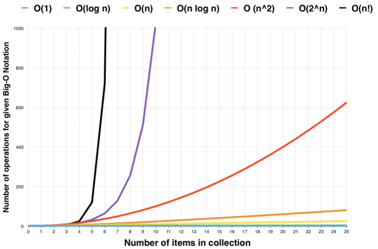

### 算法切题与刷题方法

#### 总结
##### 数据

 通过本周的学习，了解了数据结构包括：

一维数据：数组[Array]、链表[linked list]; 栈[stack]、队列[queue]、双端队列[deque]、集合[set]、映射[map]

二维数据：树[tree]、图[graph]; 二叉搜索树[binary search tree]、堆[heap]、并查集[disjoint set]、字典树[Trie]

特殊数据：位运算[Bitwise]、布隆过滤器[BloomFilter]、LRU 

##### 时间复杂度


##### 空间复杂度
 + 数组的长度
 + 递归的深度

##### 数组、链表、跳表

> 注：跳表核心思想，1.升维 2.空间换时间

+ 三者的原理和实现
+ 三者的时间、空间复杂度
+ 在工程中的运用

##### 栈、队列、优先队列、双端队列

+ 添加删除 O(1),查询O(n)
+ 

##### 刷题

  在参加培训之前自己刷题时，经常一天才弄懂一题，弄懂之后也就感觉自己已经了解了，也就不想继续刷题，导致自己的刷题周期及其的长而且没有效率，参加了超哥的培训后学习到了算法题以及面试题的一些技巧和日常练习算法的方法

*切题*--[四件套]

```
1. Clarification 理解题意；跟出题人反复沟通确保自己了解题意
2. Possible solutions 列举解法；将所有想到的解法列举出来，然后比较所有方法的时间、空间复杂度
3. Coding 编写代码；将最优解法通过代码写出来
4. Test cases 测试；对解法进行测试
```


*刷题*--[五毒神掌]

> 注最大的误区： 题目只刷一遍

```
第一遍：给自己5至10分钟的时间思考解法，5至10分钟时间没有思路直接看题解，比较题解的优劣，然后将最优题解背诵和默写下来
第二遍：自己写一遍，然后Leetcode提交，尝试多种解法并且比较解法的优劣
第三遍：隔一天后重新做题，对不同解法的熟练程度可以通过专项练习来提升自己
第四遍：隔一周后重新做题，加深解题印象
第五遍：面试前一周，恢复训练
```